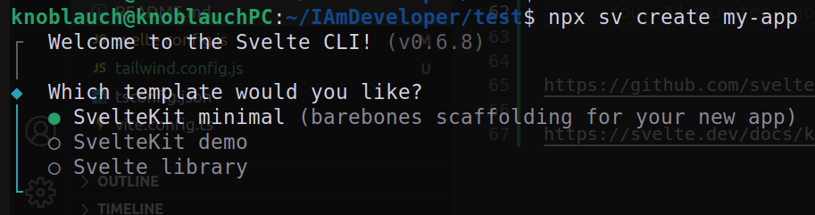
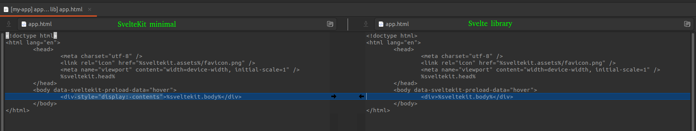

# frontend-toolkit

# Why this package?

This package aims at providing building blocks that help to kickstart a svelte-kit project able to interact with the backend services developed with [backend-toolkit](https://github.com/KnoblauchPilze/backend-toolkit).

It also defines convenience components allowing to style the various websites in a consistent way.

The content of this repository uses several existing web frameworks:
* [svelte](https://svelte.dev) as a base for the components.
* [tailwindcss](https://tailwindcss.com) for styling.

TODO: Create a template project for the frontend service and link it here.

# Badges

[](https://github.com/Knoblauchpilze/frontend-toolkit/actions/workflows/publish-package.yml)

[](https://codecov.io/gh/Knoblauchpilze/frontend-toolkit)

[](https://github.com/Knoblauchpilze/frontend-toolkit/actions/workflows/build-and-test.yml)

# What is the content of this repository?

Taken from the svelte documentation:

```
Everything inside src/lib is part of your library, everything inside src/routes can be used as a showcase or preview app.
```

The [src/lib](src/lib) defines the content of the package. It consists of two main categories of elements, described in a bit more details in the two following sections.

## Components

The [components](src/lib/components) are visual elements meant to be visually represented in web pages. They are all designed to be integrated in a svelte app and provide some basic building blocks to represent text, links and other such elements in a consistent way.

A typical example is given below:

```js
<script lang="ts">
	interface Props {
		text?: string;
		textColor?: string;
		styling?: string;
	}

	let { text = 'Missing text', textColor = 'text-secondary', styling = '' }: Props = $props();
</script>

<p class="{textColor} {styling}">{text}</p>
```

Most components also rely on the [tailwindcss](https://tailwindcss.com) library for styling.

## Tailwind styling in npm package

When publishing the `svelte` components to a package, the styling information provided by tailwind needs to be propagated to the build system of the calling code. This seems to be a typical question of people working on tailwind components in a package.

To solve this problem, [this page](https://tailwindcss.com/docs/content-configuration#working-with-third-party-libraries) in the documentation of tailwind gives a solution:


By modifying `tailwind.config.js`, we guarantee that tailwind will also process the components coming from the library and not only the ones defined in the project.

Below is the same code as in the image above but with copyable text:

```json
{
    "content": [
        "./src/**/*.{html,js,svelte,ts}",
        "./node_modules/@totocorpsoftwareinc/frontend-toolkit/**/*.svelte"
    ]
}
```

This will instruct the tailwind processor to also look for directives in this package's files.

Alternatively you can also use the [template-frontend](https://github.com/Knoblauchpilze/template-frontend) repository to kick-start a new frontend project: it will be configured automatically to use this package in a correct way.

## Style for the application

As described in the [components](#components) section, most components are using tailwind to define colours and styles.

In order to keep a common theme on the webpages, this package leverages the concept of a color theme: it means that instead of providing real colour values for the various components we rather use e.g. `bg-primary` or `text-secondary`. 

With this approach we allow to easily reuse the components in various projects where the color theme might be different.

We recommend adding the following section to your `tailwind.config.json`:

```json
{
    "theme": {
        "extend": {
            "colors": {
                "primary": "#000",
				            "primary-hover": "#222",
				            "primary-selected": "#444",
				            "secondary": "#fff",
				            "secondary-hover": "#fff",
				            "error": "#d92d0f",
				            "overlay": "#0b0b45"
            }
        }
    }
}
```

Alternatively, you can start from the template provided in [template-frontend](https://github.com/Knoblauchpilze/template-frontend).

## API interoperability

We faced the issue to have a common structure to interact with services created using the [template-go](https://github.com/Knoblauchpilze/template-go) repository.

In this repository we allow to easily create services producing responses in the following format:

```json
{
    "requestId": "e0bcdaa7-9e60-411b-a308-75e0c079abed",
    "status": "SUCCESS",
    "details": [
        "value1",
        "value2"
    ]
}
```

The process of analyzing the API responses and extracting either the failure reason or the useful data is always the same for a frontend interacting with such a service. Therefore, it makes sense to extract it as a utility toolkit.

In this package we define:
* [ApiResponse](src/lib/http/apiResponse.ts) as the building block of a response as returned by a backend service.
* some way to analyze the failure in case a response is not successful through `tryGetFailureReason`.
* a convenience set of methods to extract data from the response with `parseApiResponseAsSingleValue` (and it's array equivalent).

As the goal is to make this process safe and easily reusable, we put some effort into testing the solution properly.

The hope is that further efforts to fix bugs or integrating new features can be made easily available to all front-end services through the use of this package.

# How to get started?

## Use the package in one of your project 

You can add this package as a dependency of your project. As for any `svelte` components, it should not be necessary to add the `svelte` framework as a production dependency, only a development one.

In general, you should be able to add this package by modifying your `package.json` as shown below:

```json
{
    "dependencies": {
        "@totocorpsoftwareinc/frontend-toolkit": "^0.0.12"
    }
}
```

## Extend the library 

Some components are needed on your system to be able to add features or generally develop in this repository. Namely:
* [node](https://nodejs.org/en/download). We used version 22 during the development phase.
* `npm`. We used version TODO when developing this package.

Alternatively, this [stack overflow post](https://stackoverflow.com/questions/69029896/how-do-you-install-npm-on-ubuntu) indicated how to install both from the package manager.

Once this is done you can clone this repository with e.g.:

```bash
git clone 
```

From there you should be able to run the following commands in the root of the repository to start the demo app:

```bash
make install
make dev
```

This should open your default browser with a page showing the demo app.

## Publishing a new release

In order to make changes available to be used in other projects, we use [npmjs](https://www.npmjs.com) to host the production version of this package.

You can attempt to build the library locally with:
```bash
npm run package
```

Creating a new release is then done with the dedicated script in this repository (see [publish.sh](scripts/publish.sh)) using (from the root of this repository):

```bash
./scripts/publish.sh
```

If you don't specify any additional parameters the script will fetch the latest publish version on this GitHub repository and increase the patch version by 1.

# Learnings and info

## Useful resources

While building this package, some resources were instrumental to understand what needs to be done and how. In particular:

- the [svelte documentation](https://svelte.dev/docs/kit/packaging) about packaging and specifically the introduction to get started with how to create the project.
- this [freecodecamp](https://www.freecodecamp.org/news/how-to-create-and-publish-your-first-npm-package/) tutorial on how to publish an `npm` package: it does not apply 100% to svelte but gives a good overview.
- this [youtube video](https://www.youtube.com/watch?v=_TymiadmPrc) by `Syntax` showcases in depth how to publish a svelte package.
- this [npm documentation](https://docs.npmjs.com/cli/v10/configuring-npm/package-json#repository) link explains how to handle the `provenance` option.

## Sveltekit library template

In the [documentation](https://svelte.dev/docs/kit/creating-a-project) it is recommended to spin-up a svelte new project like so:

```bash
npx sv create my-app
cd my-app
npm install
npm run dev
```

This prompts a screen like the following:



Depending on the choice between `SvelteKit minimal ` and `Svelte library` the root html file is a bit different:



The problem seems to be that in case of a library this missing `"display: contents"` seems to prevent layout to be correctly computed in case of `height: 100%`. This is explained in a bit more details in issue [#7585](https://github.com/sveltejs/kit/discussions/7585) in the `sveltejs` project.

In order to properly test this package we added it. ⚠️ **Don't forget to add it as well in case you want to do some testing within the package repository** ⚠️
