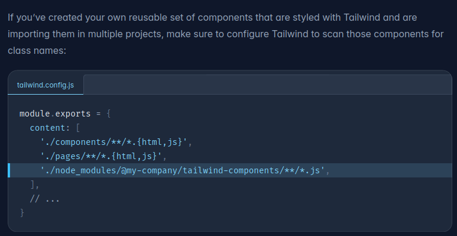

# frontend-toolkit

# Why this package?

This package aims at providing building blocks that help to kickstart a svelte-kit project able to interact with the backend services developed with [backend-toolkit](https://github.com/KnoblauchPilze/backend-toolkit).

It also defines convenience components allowing to style the various websites in a consistent way.

TODO: Create a template project for the frontend service.

# Badges

[](https://github.com/Knoblauchpilze/frontend-toolkit/actions/workflows/publish-package.yml)

[](https://codecov.io/gh/Knoblauchpilze/frontend-toolkit)

[](https://github.com/Knoblauchpilze/frontend-toolkit/actions/workflows/build-and-test.yml)

# What is the content of this repository?

Taken from the svelte documentation:

```
Everything inside src/lib is part of your library, everything inside src/routes can be used as a showcase or preview app.
```

# How to get started?

To build the library:

```bash
npm run package
```

To publish the package, you can run:

```bash
npm publish
```

# Learnings and info

## Useful resources

While building this package, some resources were instrumental to understand what needs to be done and how. In particular:

- the [svelte documentation](https://svelte.dev/docs/kit/packaging) about packaging and specifically the introduction to get started with how to create the project.
- this [freecodecamp](https://www.freecodecamp.org/news/how-to-create-and-publish-your-first-npm-package/) tutorial on how to publish an `npm` package: it does not apply 100% to svelte but gives a good overview.
- this [youtube video](https://www.youtube.com/watch?v=_TymiadmPrc) by `Syntax` which showcases how to publish a svelte package precisely.
- this [npm documentation](https://docs.npmjs.com/cli/v10/configuring-npm/package-json#repository) link explains how to handle the `provenance` option.

## Sveltekit library template

In the [documentation](https://svelte.dev/docs/kit/creating-a-project) it is recommended to spin-up a svelte new project like so:

```bash
npx sv create my-app
cd my-app
npm install
npm run dev
```

This prompts a screen like the following:


Depending on the choice between `SvelteKit minimal ` and `Svelte library` the root html file is a bit different:


The problem seems to be that in case of a library this missing `"display: contents"` seems to prevent layout to be correctly computed in case of `height: 100%`. This is explained in a bit more details in issue [#7585](https://github.com/sveltejs/kit/discussions/7585) in the `sveltejs` project.

In order to properly test this package we added it. ⚠️ **Don't forget to add it as well in case you want to do some testing within the package repository** ⚠️

## Tailwind styling in npm package

When publishing the `svelte` components to a package, the styling information provided by tailwind needs to be propagated to the build system of the calling code. This seems to be a typical question of people working on tailwind components in a package.

To solve this problem, [this page](https://tailwindcss.com/docs/content-configuration#working-with-third-party-libraries) in the documentation of tailwind gives a solution:



By doing this we guarantee that tailwind will also process the components coming from the library and not only the ones defined in the project.
